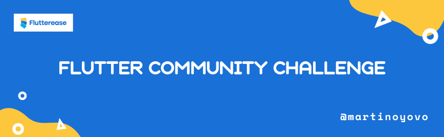

# Flutter Coding Challenge

The Flutter Community Challenge is an initiative aimed at promoting creativity and collaboration within the Flutter developer community.

Follow me on [Twitter](https://twitter.com/martinoyovo) and [LinkedIn](https://www.linkedin.com/in/martino-yovo) and star the repo 🌟 if you find this challenge useful.

This challenge encourages developers from all over the world to come together and create innovative applications using Flutter.

It’s not just about coding but also about ***learning, sharing knowledge, and growing as a community.***

## **How it works**

1. Navigate through the `challenges` folder and pick a problem to tackle. Each problem consist of a sub folder inside the `challenges` folder.

   The challenge folder is named following this format: `XXXX-problem_name`, where `XXXX` is the number of the recent problem.
2. Dive in and start working on it.
3. Once you've crafted your solution, contribute to repo by adding the GitHub link to `submissions.md` under `challenges/XXXX-problem_name/submissions.md`.

    <aside>
    🚧 Note: Make sure to use the submission text template <a href="https://github.com/martinoyovo/flutter-design-collection/submission_template.md">here</a>.

    </aside>

## **What’s next**

1. You can post your submission on social medias. Make sure to include `#fluttercommchallenge` hashtag.

   > `[OPTIONAL]`: You can tag **(Martino Yovo) @martinoyovo** to have a rapid review to your submission.
>
2. Alongside with fellow [community leads](https://twitter.com/fluttertg?lang=en), we’ll review each submission, offering valuable feedback to every participant of the challenge. If you’d like your submission not to reviewed, kindly precise it during your submission. Check submission template [here](https://github.com/martinoyovo/flutter-design-collection/submission_template.md).
3. A **solution approach** of every problem will be posted on the [***Flutterease YouTube channel***](https://www.youtube.com/@flutterease001). This solution will demonstrate possible implementation strategies for participants.
4. **Additionally, the source code for each challenge will be included in their respective folder.**

<aside>
🔥 Subscribe to the YouTube channel <a href="https://www.youtube.com/@flutterease001">here</a> and make sure to activate the notifications to stay updated.

</aside>

## **Full List of contexts and their solutions**

> From recent to oldest.
>

| Context ID | View context on GitHub | View solution on GitHub | View solution on YouTube   | Twitter Post | LinkedIn Post |
| --- | --- | --- | --- | --- | --- |
| 1 | [Google App on Sliver app bar on Android](https://github.com/martinoyovo/flutter-community-challenge/blob/main/challenges/0001-google-app-on-android-sliver-app-bar/problem.md) |  |  |  |  |

## We’re looking forward to your contributions 💙🤭🚀
